# Vision: GtoEngine as a High-Assurance Isolated Engine (v8.9.10)

This document describes the high-level vision of the **GtoEngine** as a physically isolated, intelligent component within the GPS Tracker ecosystem. It focuses on the **Isolated Engine** perspective—how the engine maintains forensic integrity by consuming raw sensor data and producing actionable security intelligence without side effects.

---

## 1. The Isolated Engine Concept
The **GtoEngine** acts as the "Sacred Vault" between raw, noisy hardware sensors and the user-facing security interface. Its primary goal is to convert **Noisy Physics** into **Clean, Actionable Security Intelligence.**

With the **v8.9.10 Baseline**, the engine is strictly isolated in the `:core:engine` module (a pure JVM library). This ensures that UI or network changes cannot corrupt the underlying security math, providing a "Truth-at-Source" model.

```mermaid
graph LR
    subgraph Inputs [Raw Resources]
        GPS[GPS/GNSS Data]
        IMU[Accelerometer/Vibration]
        MAG[Magnetometer/Heading]
        SAT[Satellite Health/SNR]
    end

    subgraph Engine [GtoEngine - :core:engine]
        GTO[Graph Optimization]
        KIM[Kinematic Modeling]
        HIN[Hindsight Correction]
        SENT[Behavioral Sentinel]
        MUZ[Sync Muzzle Window]
    end

    subgraph Outputs [Intelligence]
        TRAIL[Optimized Blue Trail]
        JUMP[Magenta Jump Squares]
        RANGE[Out-of-Range Alarms]
        JAM[Jamming Detection]
        STATE[Moving/Parking/Jumping State]
    end

    Inputs --> Engine
    Engine --> Outputs
```

---

## 2. Resources (Inputs)
The Isolated Engine acquires and correlates data from multiple hardware sources to build a ground-truth model of the asset:

*   **GPS/GNSS**: Latitude, longitude, speed, bearing, and accuracy. Monitored for stalls with **Escalated Revival** ensuring maximum uptime.
*   **Satellite Health (Raw)**: SNR (Signal-to-Noise Ratio), satellites in view vs. satellites used (to detect signal interference or multipath).
*   **Accelerometer (IMU)**: Real-time mechanical vibration signatures to determine movement states.
*   **Magnetometer**: Heading and local magnetic field stability to detect "Zig-Zag" scatter.
*   **Time Context**: Provided via `TimeProvider` (injected) to ensure monotonic integrity (`elapsedRealtime`) and immunity to system clock jumps.

---

## 3. Intelligence (Outputs)
The engine processes the inputs to produce four distinct types of intelligence for the app layer:

### 3.1. Visualization Outputs
*   **The Optimized Trail**: A high-fidelity "Blue Trail" where mechanical jitter and momentary GPS spikes have been mathematically smoothed away.
*   **Violation Markers**:
    *   **JUMP (Magenta Squares)**: Points rejected from the trajectory but preserved for forensic analysis.
    *   **RANGE (Yellow/Red Squares)**: Points where a geofence violation was confirmed as legitimate movement.

### 3.2. Security Alerts
*   **Out-of-Range Detection**: A high-confidence signal that the asset has moved beyond the "Fence" radius plus its dynamic accuracy buffer.
*   **Jamming Detection**: A specialized flag raised when satellite health is erratic/degraded while the device is otherwise healthy and online.
*   **Signal Stalling**: Detecting when the GPS hardware has "frozen." Triggers an aggressive revival loop (60s stall / 120s retry) with critical escalation.
*   **Log Spatial Anchor (v8.9.10)**: Every output intelligence event is geographically anchored, allowing the Map to display markers for where alerts originated.

---

## 4. The Value Proposition (Inside the Vault)
The "Magic" of the GtoEngine is its ability to resolve **contradictions** between sensors that standard GPS trackers cannot handle:

| Conflict | Sensor A (GPS) | Sensor B (IMU/Compass) | **GTO Output** |
| :--- | :--- | :--- | :--- |
| **Mechanical Bounce** | Move 50m (Speed 40km/h) | High Vibration | **Trail Point** (Tractor is working) |
| **GPS Jitter** | Move 50m (Speed 40km/h) | Zero Vibration | **JUMP** (Ghost movement) |
| **Theft by Towing** | Move 200m (Path = Zig-Zag) | Zero Vibration | **JUMP + 180s Hold** (Suspicious Jitter) |
| **Theft by Loading** | Move 200m (Path = Linear) | Zero Vibration | **ALARM** (Promotion to Critical) |

## 5. Conclusion
By treating trajectory as a **Graph** rather than a list of points, the **GtoEngine** provides the user with 100% confidence in the siren triggers. It allows the app to be "Aggressive against Thieves" while being "Forgiving to Signal Noise." In v8.9.10, this logic is strictly isolated and geographically anchored, ensuring forensic consistency.
